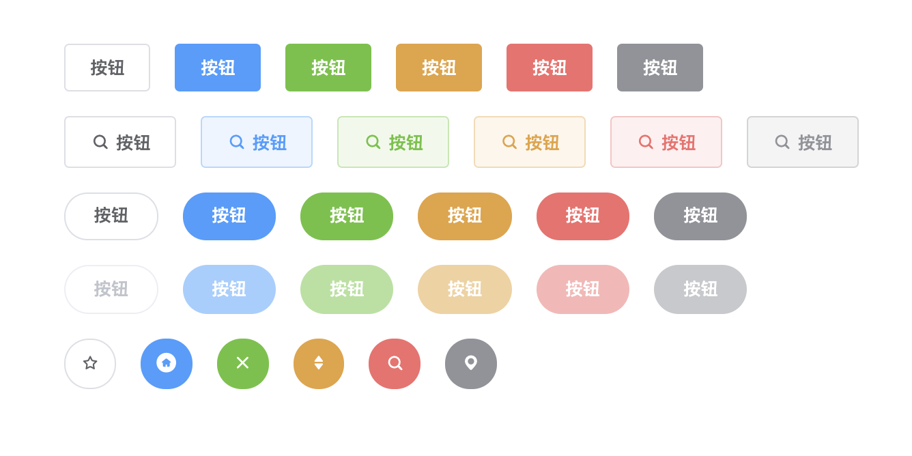

# art-ui

这个 UI 组件库是自己仿照 ElementUI 封装的 Vue 组件库，包含了简单的常用组件，但是没有像 ElementUI 那样完善，只是封装了简单的功能练手（样式均取自 ElementUI）：

- button
- dialog

以下是 art-ui 组件库的文档说明，欢迎一起交流。

## 1. Project setup

```
yarn install
```

### Compiles and hot-reloads for development

```
yarn serve
```

### Compiles and minifies for production

```
yarn build
```

### Lints and fixes files

```
yarn lint
```

## 2. button 组件

### 2.1 参数

| 参数名   | 说明     | 类型    | 可选值                              | 默认值  |
| :------- | -------- | ------- | ----------------------------------- | ------- |
| type     | 按钮类型 | string  | primary/success/warning/danger/info | default |
| plain    | 是否镂空 | boolean | -                                   | false   |
| round    | 是否圆角 | boolean | -                                   | false   |
| circle   | 是否圆形 | boolean | -                                   | false   |
| disabled | 是否禁用 | boolean | -                                   | false   |
| icon     | 图标类名 | string  | -                                   | -       |

### 2.2 事件

| 事件名 | 说明         |
| ------ | ------------ |
| click  | 按钮点击事件 |

样式图例


## 3. dialog 组件

### 3.1 参数

| 参数名  | 说明                                | 类型    | 可选值 | 默认值 |
| ------- | ----------------------------------- | ------- | ------ | ------ |
| title   | 对话框标题（也可通过具名插槽设置）  | string  | -      | 提示   |
| width   | 宽度                                | string  | -      | 50%    |
| top     | 与顶部的距离                        | string  | -      | 15vh   |
| visible | 是否显示 dialog（支持 sync 修饰符） | boolean | -      | false  |

> 关于`sync`修饰符的问题可以参考 [Vue 官网](https://cn.vuejs.org/v2/guide/components-custom-events.html#sync-%E4%BF%AE%E9%A5%B0%E7%AC%A6)

### 3.2 事件

| 事件名 | 说明            |
| ------ | --------------- |
| open   | dialog 显示事件 |
| close  | dialog 关闭事件 |

### 3.3 插槽

| 插槽名  | 说明                |
| ------- | ------------------- |
| default | dialog 的内容       |
| title   | dialog 的标题       |
| footer  | dislog 的底部操作区 |
